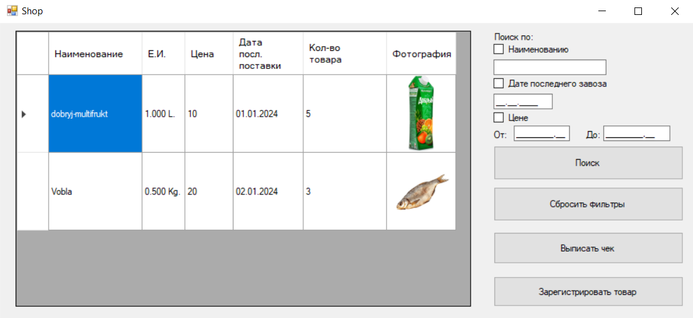
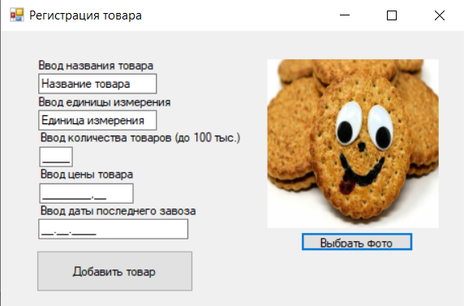
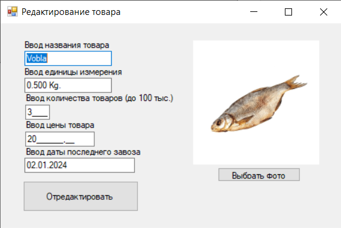
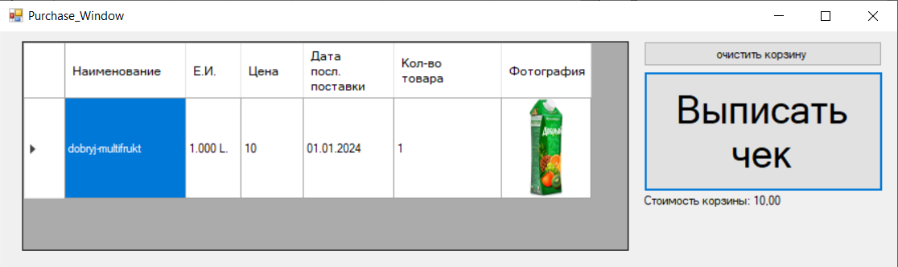

# ShopForms  

Оконное приложение на C++/CLI с использованием Windows Forms (имитатор кассы).  

### Реализованные функции:
- Чтение и запись (сохранение) в формате JSON  
- Добавление элементов в список  
- Изменение элементов списка  
- Удаление элементов  
- Поиск по элементам  
- Формирование чека  

### Основное окно  
  

### Окно регистрации товара
  

### Окно редактирования товара
  

### Окно выписки чека
  
